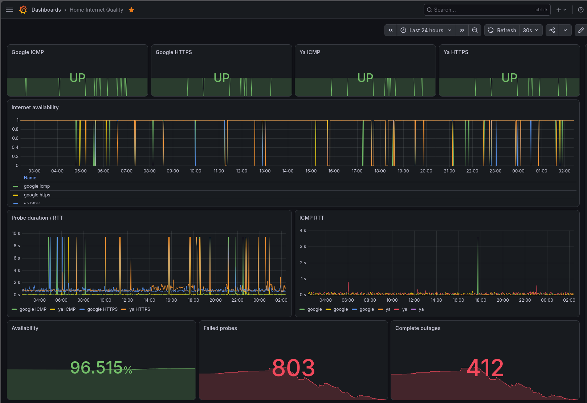

# Мониторинг качества домашнего Интернета

Prometheus + Grafana + Blackbox Exporter для обнаружения и документирования периодических обрывов домашнего Интернет-соединения.

Проект предназначен для ситуаций, когда провайдер предоставляет нестабильный доступ в Интернет, а пользователю необходимо получить объективные, timestamped и воспроизводимые данные для технической поддержки и разбора сетевых инцидентов.



---

## Содержание

- [Назначение](#назначение)
- [Что контролируется](#что-контролируется)
- [Архитектура](#архитектура)
- [Структура проекта](#структура-проекта)
- [Требования](#требования)
- [Версии компонентов](#версии-компонентов)
- [Развёртывание](#развёртывание)
- [Docker Compose](#docker-compose)
- [Blackbox Exporter](#blackbox-exporter)
- [Prometheus](#prometheus)
- [Grafana](#grafana)
- [Проверка работоспособности](#проверка-работоспособности)
- [Автоматическая трассировка при обрыве](#автоматическая-трассировка-при-обрыве)
- [systemd timer](#systemd-timer)
- [Alerting](#alerting)
- [Как читать метрики](#как-читать-метрики)
- [Как анализировать MTR](#как-анализировать-mtr)
- [Как формировать доказательства для провайдера](#как-формировать-доказательства-для-провайдера)
- [Ограничения](#ограничения)
- [Дальнейшее развитие](#дальнейшее-развитие)
- [Лицензия](#лицензия)

---

# Назначение

Основная задача проекта — автоматически определить:

1. работает ли Интернет;
2. работает ли IP-связность;
3. работает ли HTTPS;
4. когда именно начался обрыв;
5. когда соединение восстановилось;
6. затронуты ли несколько независимых внешних узлов;
7. какой сетевой путь был доступен во время аварии;
8. после какого сетевого узла начинает пропадать связность.

Система рассчитана на работу **24/7**.

Основной интервал мониторинга:

```text
15 секунд
```

За счёт этого время обнаружения проблемы ограничивается примерно одним интервалом проверки.

---

# Что контролируется

Используются четыре независимые проверки.

| Цель | Тип проверки | Назначение |
|---|---|---|
| `google.com` | ICMP | Проверка IP-связности |
| `google.com` | HTTPS | Проверка DNS/TCP/TLS/HTTP |
| `ya.ru` | ICMP | Проверка IP-связности до независимой точки |
| `ya.ru` | HTTPS | Проверка прикладного уровня |

Это существенно надёжнее, чем проверять только:

```bash
ping google.com
```

---

# Архитектура

```text
                         INTERNET
                            |
              +-------------+-------------+
              |                           |
          google.com                    ya.ru
              |                           |
              +-------------+-------------+
                            |
                       СЕТЬ ПРОВАЙДЕРА
                            |
                       ДОМАШНИЙ РОУТЕР
                            |
                            v
                 +----------------------+
                 | Ubuntu 24.04         |
                 |                      |
                 | Docker Compose       |
                 |                      |
                 | +------------------+ |
                 | | Blackbox Exporter| |
                 | |      :9115       | |
                 | +--------+---------+ |
                 |          |           |
                 | +--------v---------+ |
                 | | Prometheus       | |
                 | |      :9090       | |
                 | +--------+---------+ |
                 |          |           |
                 | +--------v---------+ |
                 | | Grafana          | |
                 | |      :3000       | |
                 | +------------------+ |
                 |                      |
                 | systemd timer        |
                 |       |              |
                 |       v              |
                 | helper диагностики   |
                 |       |              |
                 |       +--> MTR       |
                 |       +--> traceroute|
                 |       +--> ping      |
                 |       +--> DNS       |
                 +----------------------+
```

## Компоненты

### Prometheus

Prometheus каждые 15 секунд обращается к Blackbox Exporter и сохраняет результаты проверок.

Основные данные:

```text
probe_success
probe_duration_seconds
probe_icmp_duration_seconds
```

### Blackbox Exporter

Blackbox Exporter выполняет сетевые проверки:

- ICMP;
- HTTP/HTTPS.

Он не хранит историю самостоятельно — результаты передаются Prometheus.

### Grafana

Grafana отображает:

- текущий статус;
- доступность;
- задержку;
- ICMP RTT;
- количество ошибок;
- количество обрывов;
- периоды недоступности.

### Helper диагностики

Отдельный Bash-скрипт запускается непосредственно на Linux-хосте.

Он отслеживает состояние probe'ов через API Prometheus и при полном обрыве запускает:

```text
MTR
traceroute
ping
DNS lookup
ip route
```

Это сделано намеренно.

Blackbox Exporter предназначен для probing и не является инструментом автоматического MTR/traceroute.

---

# Структура проекта

Рекомендуемая структура:

```text
/opt/internet-monitor/
├── docker-compose.yml
├── prometheus/
│   ├── prometheus.yml
│   └── rules/
│       └── internet.yml
├── blackbox/
│   └── blackbox.yml
├── grafana/
│   └── provisioning/
│       └── datasources/
│           └── prometheus.yml
├── scripts/
│   └── internet-outage-trace.sh
├── traces/
│   ├── google.com/
│   └── ya.ru/
└── state/
```

Создание каталогов:

```bash
sudo mkdir -p /opt/internet-monitor/{prometheus/rules,blackbox,grafana/provisioning/datasources,traces,scripts,state}
sudo chmod 755 /opt/internet-monitor
```

---

# Требования

## Операционная система

Рекомендуемая система:

```text
Ubuntu Server 24.04
```

## Docker

Должны быть установлены:

```text
Docker Engine
Docker Compose Plugin
```

## Инструменты диагностики

Установить:

```bash
sudo apt update
sudo apt install -y mtr-tiny traceroute iputils-ping curl jq
```

Проверить:

```bash
docker --version
docker compose version
mtr --version
traceroute --version
ping -V
curl --version
jq --version
```

---

# Версии компонентов

Используются зафиксированные версии:

| Компонент | Версия |
|---|---|
| Prometheus | `v3.13.2` |
| Grafana | `13.1.3` |
| Blackbox Exporter | `v0.28.0` |

В Docker Compose используются конкретные теги, а не `latest`.

Это позволяет избежать непредсказуемых изменений при последующем:

```bash
docker compose pull
```

---

# Развёртывание

Перейти в каталог:

```bash
cd /opt/internet-monitor
```

После создания всех конфигурационных файлов сначала проверить Compose:

```bash
docker compose config
```

Если ошибок нет:

```bash
docker compose pull
docker compose up -d
```

Проверить состояние:

```bash
docker compose ps
```

Ожидаются контейнеры:

```text
internet-prometheus
internet-blackbox
internet-grafana
```

Посмотреть логи:

```bash
docker compose logs -n 100
```

---

# Docker Compose

Файл:

```text
/opt/internet-monitor/docker-compose.yml
```

Содержимое:

```yaml
services:

  prometheus:
    image: prom/prometheus:v3.13.2
    container_name: internet-prometheus
    restart: unless-stopped
    command:
      - --config.file=/etc/prometheus/prometheus.yml
      - --storage.tsdb.path=/prometheus
      - --storage.tsdb.retention.time=180d
      - --storage.tsdb.retention.size=20GB
      - --web.enable-lifecycle
    ports:
      - "127.0.0.1:9090:9090"
    volumes:
      - ./prometheus/prometheus.yml:/etc/prometheus/prometheus.yml:ro
      - ./prometheus/rules:/etc/prometheus/rules:ro
      - prometheus_data:/prometheus
    depends_on:
      - blackbox-exporter
    networks:
      - monitoring


  blackbox-exporter:
    image: quay.io/prometheus/blackbox-exporter:v0.28.0
    container_name: internet-blackbox
    restart: unless-stopped
    command:
      - --config.file=/config/blackbox.yml
    cap_add:
      - NET_RAW
    ports:
      - "127.0.0.1:9115:9115"
    volumes:
      - ./blackbox/blackbox.yml:/config/blackbox.yml:ro
    networks:
      - monitoring


  grafana:
    image: grafana/grafana:13.1.3
    container_name: internet-grafana
    restart: unless-stopped
    environment:
      GF_SECURITY_ADMIN_USER: admin
      GF_SECURITY_ADMIN_PASSWORD: admin
      GF_USERS_ALLOW_SIGN_UP: "false"
      GF_ANALYTICS_REPORTING_ENABLED: "false"
      GF_ANALYTICS_CHECK_FOR_UPDATES: "false"
    ports:
      - "3000:3000"
    volumes:
      - grafana_data:/var/lib/grafana
      - ./grafana/provisioning:/etc/grafana/provisioning:ro
    depends_on:
      - prometheus
    networks:
      - monitoring


volumes:
  prometheus_data:
  grafana_data:


networks:
  monitoring:
    driver: bridge
```

## Безопасность

Prometheus и Blackbox Exporter привязаны к:

```text
127.0.0.1
```

Поэтому они не публикуются непосредственно в Интернет.

Не следует использовать:

```yaml
privileged: true
```

для Blackbox Exporter.

Вместо этого используется минимально необходимая capability:

```yaml
cap_add:
  - NET_RAW
```

---

# Почему нужен `CAP_NET_RAW`

Для ICMP-проверок контейнеру Blackbox Exporter требуется возможность создавать raw sockets.

Поэтому в Compose присутствует:

```yaml
cap_add:
  - NET_RAW
```

Альтернативным механизмом является настройка:

```text
net.ipv4.ping_group_range
```

для разрешения ping sockets соответствующей группе.

В данном проекте используется `NET_RAW`, поскольку это явно задаёт необходимую capability контейнера.

---

# Blackbox Exporter

Файл:

```text
/opt/internet-monitor/blackbox/blackbox.yml
```

```yaml
modules:
  icmp:
    prober: icmp
    timeout: 10s
    icmp:
      preferred_ip_protocol: ip4


  http_2xx:
    prober: http
    timeout: 10s
    http:
      method: GET
      preferred_ip_protocol: ip4
      valid_status_codes:
        - 200
        - 201
        - 202
        - 203
        - 204
        - 205
        - 206
        - 207
        - 208
        - 226
      fail_if_ssl: false
      fail_if_not_ssl: false
      tls_config:
        insecure_skip_verify: false
      follow_redirects: true
```

HTTPS-проверка выполняет настоящий HTTP GET.

Логическая цепочка:

```text
DNS
 |
 v
TCP
 |
 v
TLS
 |
 v
HTTP GET
 |
 v
HTTP response
```

Таким образом, проверяется не только доступность IP-адреса.

---

# Prometheus

Файл:

```text
/opt/internet-monitor/prometheus/prometheus.yml
```

```yaml
global:
  scrape_interval: 15s
  scrape_timeout: 10s
  evaluation_interval: 15s


rule_files:
  - /etc/prometheus/rules/*.yml


scrape_configs:
  - job_name: blackbox
    metrics_path: /probe
    params:
      module:
        - icmp

    static_configs:
      - targets:
          - google.com
        labels:
          probe_target: google
          probe_type: icmp
      - targets:
          - ya.ru
        labels:
          probe_target: ya
          probe_type: icmp

    relabel_configs:
      - source_labels:
          - __address__
        target_label: __param_target
      - source_labels:
          - __param_target
        target_label: instance
      - target_label: __address__
        replacement: blackbox-exporter:9115


  - job_name: blackbox-https
    metrics_path: /probe
    params:
      module:
        - http_2xx

    static_configs:
      - targets:
          - https://google.com
        labels:
          probe_target: google
          probe_type: https
      - targets:
          - https://ya.ru
        labels:
          probe_target: ya
          probe_type: https

    relabel_configs:
      - source_labels:
          - __address__
        target_label: __param_target
      - source_labels:
          - __param_target
        target_label: instance
      - target_label: __address__
        replacement: blackbox-exporter:9115
```

## Как работают relabel_configs

Исходный target:

```text
google.com
```

передаётся в:

```text
__param_target
```

затем:

```text
__param_target -> instance
```

и сам адрес scrape заменяется на:

```text
blackbox-exporter:9115
```

В итоге Prometheus фактически делает:

```text
GET /probe?target=google.com&module=icmp
```

у Blackbox Exporter.

---

# Grafana

## Datasource

Файл:

```text
/opt/internet-monitor/grafana/provisioning/datasources/prometheus.yml
```

```yaml
apiVersion: 1
datasources:
  - name: Prometheus
    type: prometheus
    access: proxy
    url: http://prometheus:9090
    isDefault: true
    editable: false
```

После изменения:

```bash
docker compose restart grafana
```

Grafana:

```text
http://SERVER_IP:3000
```

---

# Grafana Dashboard

Dashboard должен показывать:

- текущий статус Google ICMP;
- текущий статус Google HTTPS;
- текущий статус Ya.ru ICMP;
- текущий статус Ya.ru HTTPS;
- длительность probe;
- ICMP RTT;
- процент доступности;
- количество failed probes;
- количество полных обрывов;
- историю `probe_success`.

Dashboard JSON можно импортировать через:

```text
Grafana
  -> Dashboards
  -> Import
```


---
# Основные PromQL-запросы

## Статус всех проверок

```promql
probe_success
```

## Google

```promql
probe_success{probe_target="google"}
```

## Ya.ru

```promql
probe_success{probe_target="ya"}
```

## Только ICMP

```promql
probe_success{probe_type="icmp"}
```

## Только HTTPS

```promql
probe_success{probe_type="https"}
```

## Общая длительность проверки

```promql
probe_duration_seconds
```

## ICMP RTT

```promql
probe_icmp_duration_seconds
```

---

# Проверка работоспособности

## Проверка ICMP

```bash
curl 'http://127.0.0.1:9115/probe?target=google.com&module=icmp'
```

В ответе должно присутствовать:

```text
probe_success 1
```

Проверить Ya.ru:

```bash
curl 'http://127.0.0.1:9115/probe?target=ya.ru&module=icmp'
```

## Проверка HTTPS

```bash
curl 'http://127.0.0.1:9115/probe?target=https://google.com&module=http_2xx'
```

И:

```bash
curl 'http://127.0.0.1:9115/probe?target=https://ya.ru&module=http_2xx'
```

В обоих случаях ожидается:

```text
probe_success 1
```

---

# Проверка Prometheus

Открыть:

```text
http://127.0.0.1:9090
```

Выполнить:

```promql
probe_success
```

Должны присутствовать четыре проверки:

```text
google.com        ICMP
ya.ru             ICMP
https://google.com HTTPS
https://ya.ru      HTTPS
```

Проверить готовность Prometheus:

```bash
curl http://127.0.0.1:9090/-/ready
```

---

# Автоматическая трассировка при обрыве

Blackbox Exporter не используется для MTR.

Причина проста:

```text
Blackbox Exporter = probing
Linux host = диагностика маршрута
```

MTR должен запускаться с того же сетевого окружения, из которого пользователь получает Интернет.

---

# Скрипт диагностики

Файл:

```text
/opt/internet-monitor/scripts/internet-outage-trace.sh
```

```bash
#!/usr/bin/env bash

set -uo pipefail

PROMETHEUS_URL="http://127.0.0.1:9090"

TRACE_DIR="/opt/internet-monitor/traces"

STATE_DIR="/opt/internet-monitor/state"

LOCK_FILE="/run/internet-outage-trace.lock"

TARGETS=(
    "google.com"
    "ya.ru"
)

mkdir -p "${TRACE_DIR}"
mkdir -p "${STATE_DIR}"

exec 9>"${LOCK_FILE}"

if ! flock -n 9; then
    exit 0
fi


get_probe_status() {

    local target="$1"
    local probe_type="$2"

    curl \
        --silent \
        --show-error \
        --fail \
        --max-time 5 \
        --get \
        --data-urlencode \
            "query=probe_success{probe_target=\"${target}\",probe_type=\"${probe_type}\"}" \
        "${PROMETHEUS_URL}/api/v1/query" |
        jq -r '
            if .status == "success" and (.data.result | length) > 0
            then .data.result[0].value[1]
            else "unknown"
            end
        '
}


run_mtr() {

    local target="$1"
    local timestamp="$2"

    local target_dir="${TRACE_DIR}/${target}"

    mkdir -p "${target_dir}"

    local output_file="${target_dir}/${timestamp}.log"

    {
        echo "============================================================"
        echo "Internet outage detected"
        echo "Target: ${target}"
        echo "Timestamp: $(date --iso-8601=seconds)"
        echo "Hostname: $(hostname -f 2>/dev/null || hostname)"
        echo "============================================================"
        echo

        echo "### DNS"
        echo

        getent ahostsv4 "${target}" || true

        echo
        echo "### MTR"
        echo

        mtr \
            --report \
            --report-cycles 20 \
            --no-dns \
            --show-ips \
            "${target}" || true

        echo
        echo "### Traceroute"
        echo

        if command -v traceroute >/dev/null 2>&1; then
            traceroute \
                -n \
                -w 1 \
                -q 2 \
                -m 30 \
                "${target}" || true
        else
            echo "traceroute is not installed"
        fi

        echo
        echo "### Ping"
        echo

        ping \
            -4 \
            -c 10 \
            -W 1 \
            "${target}" || true

        echo
        echo "### Route"
        echo

        ip route get "$(getent ahostsv4 "${target}" | awk 'NR==1 {print $1}')" 2>/dev/null || true

        echo
        echo "============================================================"
        echo "Trace finished"
        echo "============================================================"

    } >> "${output_file}" 2>&1
}


timestamp="$(date '+%Y-%m-%d_%H-%M-%S')"

google_icmp="$(get_probe_status "google" "icmp")"
google_https="$(get_probe_status "google" "https")"

ya_icmp="$(get_probe_status "ya" "icmp")"
ya_https="$(get_probe_status "ya" "https")"


current_state="${google_icmp}:${google_https}:${ya_icmp}:${ya_https}"

state_file="${STATE_DIR}/current.state"

previous_state="unknown"

if [[ -f "${state_file}" ]]; then
    previous_state="$(cat "${state_file}")"
fi

printf '%s\n' "${current_state}" > "${state_file}"


echo "$(date --iso-8601=seconds) current=${current_state} previous=${previous_state}" \
    >> "${STATE_DIR}/helper.log"


all_down="false"

if [[ "${google_icmp}" == "0" ]] &&
   [[ "${google_https}" == "0" ]] &&
   [[ "${ya_icmp}" == "0" ]] &&
   [[ "${ya_https}" == "0" ]]; then

    all_down="true"

fi


if [[ "${all_down}" != "true" ]]; then
    exit 0
fi


if [[ "${previous_state}" == "${current_state}" ]]; then
    exit 0
fi


echo "$(date --iso-8601=seconds) INTERNET OUTAGE DETECTED" \
    >> "${STATE_DIR}/helper.log"


for target in "${TARGETS[@]}"; do
    run_mtr "${target}" "${timestamp}"
done
```

Сделать исполняемым:

```bash
sudo chmod +x /opt/internet-monitor/scripts/internet-outage-trace.sh
```

---

# Как работает helper

Helper получает из Prometheus четыре состояния:

```text
Google ICMP
Google HTTPS
Ya.ru ICMP
Ya.ru HTTPS
```

Например:

```text
1:1:1:1
```

означает, что все проверки успешны.

При:

```text
0:0:0:0
```

все проверки недоступны.

Если состояние изменилось:

```text
1:1:1:1
      |
      v
0:0:0:0
```

фиксируется начало полного обрыва.

После этого запускаются:

```text
MTR google.com
MTR ya.ru

traceroute google.com
traceroute ya.ru

ping google.com
ping ya.ru
```

Также записываются:

```text
DNS
ip route
hostname
timestamp
```

---

# Почему MTR не запускается каждые 15 секунд

Постоянный запуск MTR создаёт ненужный дополнительный трафик.

Например:

```text
UP
 |
 |
 v
DOWN
 |
 +-- MTR
 |
DOWN
 |
 +-- ничего
 |
DOWN
 |
 +-- ничего
 |
 v
UP
```

При следующем:

```text
UP -> DOWN
```

MTR снова запускается.

Это позволяет получить диагностическую информацию непосредственно во время инцидента, не создавая постоянный поток диагностических пакетов.

---

# systemd timer

Для интервала 15 секунд обычный cron не подходит.

Используется systemd timer.

## Service

Файл:

```text
/etc/systemd/system/internet-outage-trace.service
```

```ini
[Unit]
Description=Internet outage traceroute/MTR helper
After=docker.service
Wants=docker.service

[Service]
Type=oneshot
ExecStart=/opt/internet-monitor/scripts/internet-outage-trace.sh
```

## Timer

Файл:

```text
/etc/systemd/system/internet-outage-trace.timer
```

```ini
[Unit]
Description=Run internet outage detection every 15 seconds

[Timer]
OnBootSec=30s
OnUnitActiveSec=15s
AccuracySec=1s
Persistent=false

[Install]
WantedBy=timers.target
```

Активировать:

```bash
sudo systemctl daemon-reload
sudo systemctl enable --now internet-outage-trace.timer
```

Проверить:

```bash
systemctl status internet-outage-trace.timer
```

И:

```bash
systemctl list-timers | grep internet-outage
```

Посмотреть журнал:

```bash
journalctl -u internet-outage-trace.service
```

Запустить вручную:

```bash
sudo /opt/internet-monitor/scripts/internet-outage-trace.sh
```

---

# Cron как альтернатива

Обычный cron имеет минутное разрешение.

Можно использовать:

```cron
* * * * * /opt/internet-monitor/scripts/internet-outage-trace.sh
```

Но для данного проекта рекомендуется systemd timer.

---

# Где сохраняются результаты диагностики

Файлы создаются:

```text
/opt/internet-monitor/traces/
```

Например:

```text
/opt/internet-monitor/traces/google.com/2026-08-25_21-15-00.log
/opt/internet-monitor/traces/ya.ru/2026-08-25_21-15-00.log
```

Список файлов:

```bash
find /opt/internet-monitor/traces -type f -print
```

Просмотр:

```bash
cat /opt/internet-monitor/traces/google.com/2026-08-25_21-15-00.log
```


---

# Как читать метрики

## Нормальная работа

```text
Google ICMP      UP
Google HTTPS     UP
Ya.ru ICMP       UP
Ya.ru HTTPS      UP
```

Это нормальное состояние.

---

## Полный обрыв

```text
Google ICMP      DOWN
Google HTTPS     DOWN
Ya.ru ICMP       DOWN
Ya.ru HTTPS      DOWN
```

Это сильный признак полного отсутствия внешней связности.

---

## ICMP не работает, HTTPS работает

```text
Google ICMP      DOWN
Google HTTPS     UP
```

Возможные причины:

- фильтрация ICMP;
- ограничение ICMP на удалённом сервере;
- потеря отдельных ICMP-пакетов;
- проблема конкретного маршрута.

Само по себе это не доказывает отсутствие Интернета.

---

## ICMP работает, HTTPS не работает

```text
Google ICMP      UP
Google HTTPS     DOWN
```

Возможны проблемы на более высоком уровне:

```text
DNS
TCP
TLS
HTTP
фильтрация
удалённый сервис
```

---

# Как анализировать MTR

Пример:

```text
HOST: google.com

HOST:                   Loss%   Snt   Last   Avg  Best  Wrst StDev
 1. 192.168.1.1          0.0%    20    0.8   0.9   0.7   1.3   0.1
 2. 10.10.0.1            0.0%    20    4.1   4.0   3.7   4.8   0.3
 3. 100.64.1.1           0.0%    20    7.2   7.4   6.9   9.1   0.5
 4. 172.16.20.1          0.0%    20   11.0  10.9  10.4  12.8   0.6
 5. 185.x.x.x            0.0%    20   14.2  14.3  13.9  16.1   0.5
 6. 203.x.x.x             0.0%    20   18.4  18.7  18.0  21.3   0.8
 7. 72.14.x.x           100.0%    20     -     -     -     -     -
 8. 142.250.x.x         100.0%    20     -     -     -     -     -
```

Нельзя автоматически делать вывод:

```text
hop 7 = 100%
```

значит:

```text
hop 7 неисправен.
```

Маршрутизаторы могут ограничивать или полностью фильтровать ICMP-ответы.

Гораздо более значимая картина:

```text
hop 6       0%
hop 7     100%
hop 8     100%
destination 100%
```

Если потеря начинается после определённого hop и сохраняется на всех последующих hop вплоть до конечного узла, это указывает на проблему где-то после последнего стабильно доступного узла.

---

# Как использовать два независимых направления

Предположим, во время одного инцидента:

```text
Google:
hop 6 -> отвечает
hop 7 -> недоступен
destination -> недоступен
```

и одновременно:

```text
Ya.ru:
hop 6 -> отвечает
hop 7 -> недоступен
destination -> недоступен
```

Это существенно сильнее, чем проблема только с Google.

Условная схема:

```text
                    СЕТЬ ПРОВАЙДЕРА
                           |
                        [hop 7]
                        /      \
                       /        \
                  Google        Ya.ru
                     X            X
```

Одинаковый момент отказа по нескольким направлениям является хорошим основанием для дальнейшего расследования со стороны провайдера.

---

# Важное ограничение MTR

MTR не является абсолютным доказательством неисправности конкретного маршрутизатора.

Например:

```text
hop 3       50% loss
hop 4        0% loss
destination  0% loss
```

скорее всего означает ICMP rate limiting на третьем hop.

Поэтому при анализе нужно смотреть не только на конкретный hop, но и на поведение последующих узлов и конечного адресата.

---

# Как формировать доказательства для провайдера

Полезный инцидент должен содержать:

```text
Время начала
Время окончания
Продолжительность
Google ICMP
Google HTTPS
Ya.ru ICMP
Ya.ru HTTPS
MTR Google
MTR Ya.ru
```

Например:

```text
2026-08-25 21:15:00
Google ICMP      DOWN
Google HTTPS     DOWN
Ya.ru ICMP       DOWN
Ya.ru HTTPS      DOWN
```

Восстановление:

```text
2026-08-25 21:22:42
```

Продолжительность:

```text
7 минут 42 секунды
```

Во время инцидента MTR может показать:

```text
192.168.1.1       0%
ISP hop #1        0%
ISP hop #2        0%
ISP hop #3        0%
ISP hop #4       100%
ISP hop #5       100%
Google           100%
```

Такой отчёт значительно полезнее субъективного сообщения:

> Интернет периодически пропадает.

---

# Дополнительный уровень мониторинга: домашний роутер

Для полноценного доказательства желательно добавить ICMP-проверку локального маршрутизатора.

Например:

```text
192.168.1.1
```

Получится:

```text
Мониторинг
    |
    v
192.168.1.1
    |
    v
ISP gateway
    |
    v
Internet
```

Интерпретация:

### Роутер недоступен

```text
Local router    DOWN
Google          DOWN
Ya.ru           DOWN
```

Нужно исследовать:

- Ethernet;
- Wi-Fi;
- домашний роутер;
- питание;
- локальную сеть;
- сам monitoring host.

### Роутер доступен, Интернет недоступен

```text
Local router    UP
Google          DOWN
Ya.ru           DOWN
```

Это значительно сильнее указывает на проблему за пределами локальной сети.

---

# Дополнительный уровень: первый узел провайдера

После накопления нескольких MTR можно определить первый адрес сети провайдера.

Например:

```text
1. 192.168.1.1
2. 100.64.x.x
3. 10.x.x.x
4. ...
```

Первый ISP-side адрес можно добавить отдельной ICMP-проверкой.

Тогда система сможет разделить:

```text
HOME
 |
 v
LOCAL ROUTER
 |
 v
ISP GATEWAY
 |
 v
INTERNET
```

Это ещё сильнее повышает качество диагностики.

---

# Почему полезно хранить историю 180 дней

Периодические проблемы трудно доказать по одному инциденту.

История позволяет получить статистику:

```text
Период: 30 дней

Доступность: 99.31%

Количество полных обрывов: 17

Самый длинный обрыв: 7 минут 42 секунды
```

Вместо:

> Интернет иногда пропадает.

можно показать:

> За последние 30 дней зафиксировано 17 полных обрывов, при которых одновременно не проходили ICMP и HTTPS-проверки двух независимых внешних направлений.

---

# Ограничения

## ICMP не является абсолютным индикатором доступности

Некоторые серверы и маршрутизаторы фильтруют ICMP.

Поэтому проект использует одновременно:

```text
ICMP
HTTPS
```

## MTR не доказывает неисправность конкретного маршрутизатора

Необходимо анализировать потерю на последующих hop и конечном адресате.

## Google и Ya.ru являются внешними сервисами

Отказ конкретного сервиса не обязательно означает проблему провайдера.

Поэтому используются два независимых направления.

## DNS может быть отдельной причиной

Если ICMP работает, а HTTPS не работает, необходимо учитывать проблемы DNS.

Helper поэтому дополнительно записывает результат:

```bash
getent ahostsv4
```

---
# Проверка после установки

Полный минимальный набор проверок:

```bash
cd /opt/internet-monitor

docker compose config

docker compose ps

curl http://127.0.0.1:9090/-/ready

curl 'http://127.0.0.1:9115/probe?target=google.com&module=icmp'

curl 'http://127.0.0.1:9115/probe?target=ya.ru&module=icmp'

curl 'http://127.0.0.1:9115/probe?target=https://google.com&module=http_2xx'

curl 'http://127.0.0.1:9115/probe?target=https://ya.ru&module=http_2xx'

systemctl status internet-outage-trace.timer

sudo /opt/internet-monitor/scripts/internet-outage-trace.sh
```

---

# Итог

Проект предоставляет компактную систему наблюдения за качеством домашнего Интернет-соединения:

```text
Blackbox Exporter
        |
        v
    Prometheus
        |
        v
     Grafana
```

и отдельный диагностический контур:

```text
systemd timer
      |
      v
helper
      |
      +--> MTR
      +--> traceroute
      +--> ping
      +--> DNS
      +--> route
```

Основной принцип проекта — не полагаться на единственный показатель.

Используются одновременно:

```text
ICMP
HTTPS
несколько внешних направлений
история Prometheus
MTR
traceroute
DNS
локальный маршрут
```

Это позволяет ответить на ключевые вопросы:

- Когда начался обрыв?
- Когда соединение восстановилось?
- Сколько длился инцидент?
- Работал ли локальный роутер?
- Работал ли IP-уровень?
- Работал ли HTTPS?
- Были ли недоступны одновременно несколько независимых направлений?
- Как изменялась задержка перед аварией?
- После какого hop переставала проходить трассировка?
- Восстанавливался ли маршрут после восстановления Интернета?

В результате периодический и субъективно описываемый как «интернет иногда пропадает» сбой превращается в воспроизводимый сетевой инцидент с временными метками, метриками и диагностическими логами.

---

# Лицензия

```text
MIT License

Copyright (c) 2026

Permission is hereby granted, free of charge, to any person obtaining a copy
of this software and associated documentation files, to deal in the Software
without restriction, including without limitation the rights to use, copy,
modify, merge, publish, distribute, sublicense, and/or sell copies of the
Software, and to permit persons to whom the Software is furnished to do so,
subject to the following conditions:

The above copyright notice and this permission notice shall be included in all
copies or substantial portions of the Software.

THE SOFTWARE IS PROVIDED "AS IS", WITHOUT WARRANTY OF ANY KIND, EXPRESS OR
IMPLIED, INCLUDING BUT NOT LIMITED TO THE WARRANTIES OF MERCHANTABILITY,
FITNESS FOR A PARTICULAR PURPOSE AND NONINFRINGEMENT. IN NO EVENT SHALL THE
AUTHORS OR COPYRIGHT HOLDERS BE LIABLE FOR ANY CLAIM, DAMAGES OR OTHER
LIABILITY, WHETHER IN AN ACTION OF CONTRACT, TORT OR OTHERWISE, ARISING FROM,
OUT OF OR IN CONNECTION WITH THE SOFTWARE OR THE USE OR OTHER DEALINGS IN THE
SOFTWARE.
```